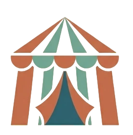
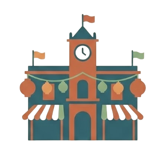
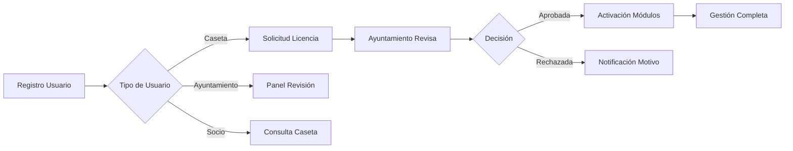
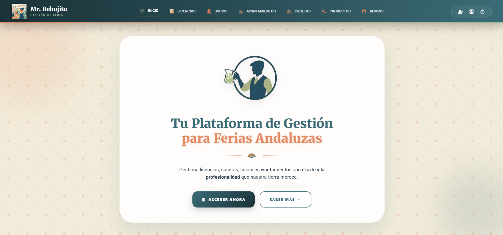
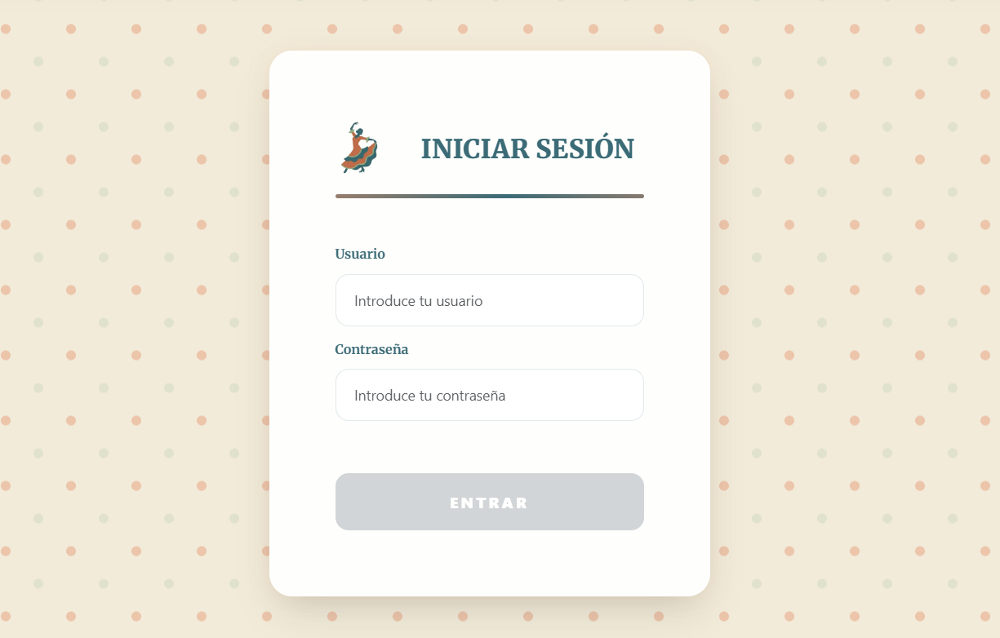
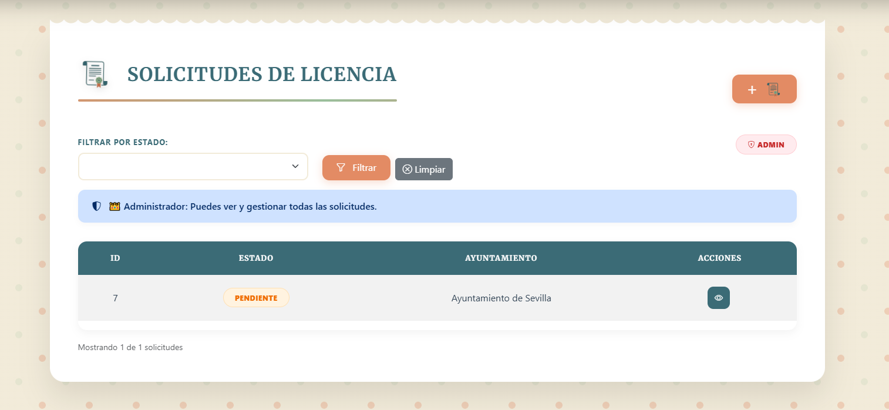
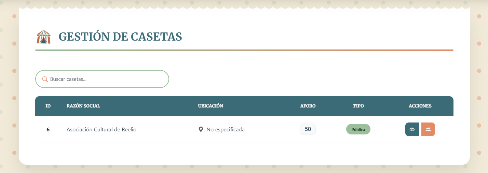
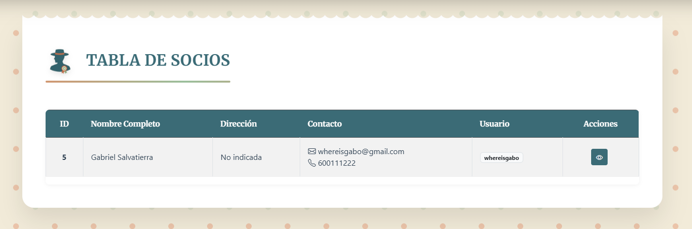
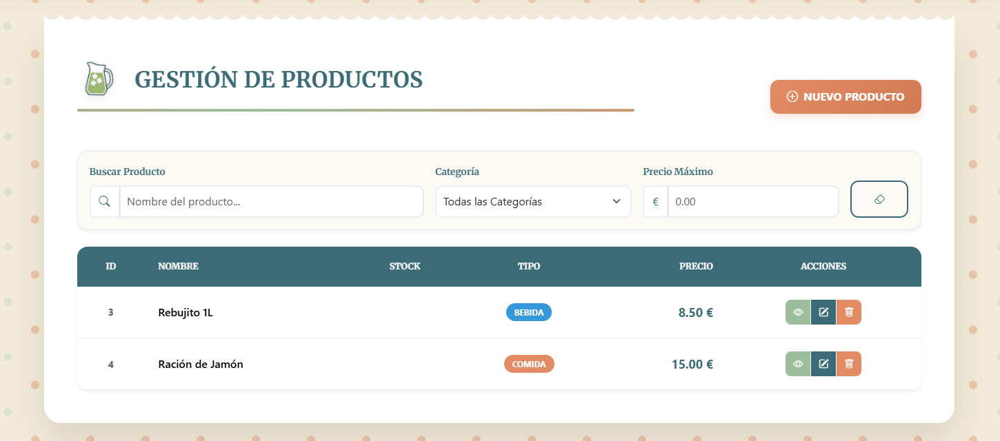
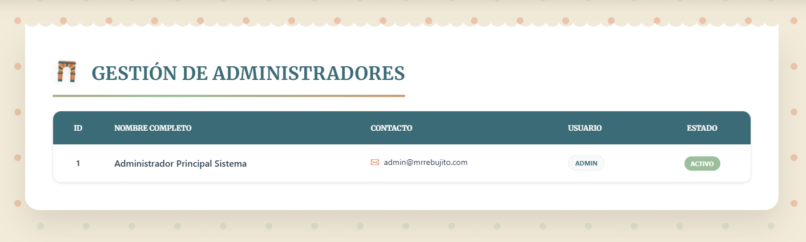

<div align="center">

# 🎭 Mr. Rebujito

### _Gestión Digital de Ferias Andaluzas con Arte y Profesionalidad_


[](https://spring.io/projects/spring-boot)
[](https://angular.io/)
[](https://www.typescriptlang.org/)
[](https://getbootstrap.com/)

[]()
[]()
[]()

**Proyecto de Angular de Desarrollo de Aplicaciones Multiplataforma**  
_IES Francisco Rodríguez Marín • Osuna, Sevilla (41640)_

---

</div>

## 📑 Tabla de Contenidos

- [🎪 Sobre el Proyecto](#-sobre-el-proyecto)
- [✨ Características Principales](#-características-principales)
- [🛠️ Tecnologías Utilizadas](#️-tecnologías-utilizadas)
- [🏗️ Arquitectura del Sistema](#️-arquitectura-del-sistema)
- [🚀 Instalación y Configuración](#-instalación-y-configuración)
- [👥 Roles y Permisos](#-roles-y-permisos)
- [📦 Estructura del Proyecto](#-estructura-del-proyecto)
- [🎯 Funcionalidades Detalladas](#-funcionalidades-detalladas)
- [🔐 Seguridad y Autenticación](#-seguridad-y-autenticación)
- [📸 Capturas de Pantalla](#-capturas-de-pantalla)
- [🧪 Testing](#-testing)
- [📚 Documentación API](#-documentación-api)
- [🤝 Equipo de Desarrollo](#-equipo-de-desarrollo)
- [📄 Licencia](#-licencia)

---

## 🎪 Sobre el Proyecto

**Mr. Rebujito** es una plataforma web integral que revoluciona la gestión de ferias andaluzas mediante la digitalización de procesos tradicionales. El sistema centraliza y automatiza la administración de casetas, socios, licencias, inventarios y ayuntamientos, llevando la tradición ferial al siglo XXI sin perder su esencia.

### 🎯 Objetivos del Proyecto

- **Digitalizar** la burocracia ferial tradicional
- **Centralizar** la gestión de múltiples entidades (Casetas, Ayuntamientos, Socios)
- **Automatizar** procesos de solicitud y aprobación de licencias
- **Facilitar** la comunicación entre todos los actores del ecosistema ferial
- **Modernizar** la experiencia de gestión manteniendo el espíritu andaluz

### 🌟 Contexto Académico

Este proyecto ha sido desarrollado como Trabajo Final para el módulo de **Optativa GS** del ciclo de **Desarrollo de Aplicaciones Multiplataforma** en el **IES Francisco Rodríguez Marín** de Osuna (Sevilla).

El objetivo principal es demostrar la integración profesional de tecnologías modernas (Spring Boot + Angular) en un caso de uso real aplicado a la gestión cultural andaluza.

---

## ✨ Características Principales

<div align="center">

| Módulo                        | Descripción                                                                | Icono                                                   |
| ----------------------------- | -------------------------------------------------------------------------- | ------------------------------------------------------- |
| **Gestión de Licencias**      | Sistema completo de solicitud, revisión y aprobación de licencias feriales |  |
| **Administración de Casetas** | Control de aforo, ubicación, tipología y gestión integral de casetas       |                |
| **Gestión de Socios**         | Registro, control de cuotas y administración de integrantes                |                  |
| **Panel de Ayuntamientos**    | Gestión de ferias, configuración de espacios y validación de solicitudes   |    |
| **Inventario de Productos**   | Gestión de carta, stock y precios de productos de casetas                  |    |
| **Panel de Administración**   | Control total del sistema, gestión de usuarios y configuración             |                |

</div>

### 🎨 Diseño y UX

- **Interfaz inspirada en la estética de feria andaluza**
  - Paleta de colores característicos (naranja teja, verde caseta, azul oscuro)
  - Fondos animados con lunares (patrón típico de los trajes de flamenca)
  - Tipografía Merriweather para títulos (elegancia sevillana)
  - Elementos visuales: abanicos, guitarras, castañuelas, peinetas

- **Diseño Responsive y Moderno**
  - Compatible con dispositivos móviles, tablets y escritorio
  - Tarjetas con efecto "cristal" (backdrop-filter blur)
  - Animaciones suaves y transiciones fluidas
  - Iconografía personalizada en formato WebP

### 🔄 Flujo de Trabajo Principal



---

## 🛠️ Tecnologías Utilizadas

### Backend - Spring Boot

<div align="center">

| Tecnología          | Versión | Propósito                        |
| ------------------- | ------- | -------------------------------- |
| **Spring Boot**     | 3.2+    | Framework principal del backend  |
| **Spring Security** | 6.2+    | Autenticación y autorización JWT |
| **Spring Data JPA** | 3.2+    | Persistencia y ORM               |
| **MySQL**           | 8.0+    | Base de datos relacional         |
| **Maven**           | 3.9+    | Gestión de dependencias          |
| **Lombok**          | 1.18+   | Reducción de código boilerplate  |
| **JWT (jjwt)**      | 0.12+   | Tokens de autenticación          |

</div>

### Frontend - Angular

<div align="center">

| Tecnología          | Versión | Propósito                          |
| ------------------- | ------- | ---------------------------------- |
| **Angular**         | 17+     | Framework SPA principal            |
| **TypeScript**      | 5.0+    | Lenguaje tipado                    |
| **RxJS**            | 7.8+    | Programación reactiva              |
| **Bootstrap**       | 5.3+    | Framework CSS base                 |
| **Bootstrap Icons** | 1.11+   | Iconografía complementaria         |
| **Google Fonts**    | -       | Tipografías (Merriweather, Roboto) |

</div>

### Paleta de Colores del Proyecto

```css
:root {
  --mr-primary: #e38b64; /* Naranja Teja - Color principal */
  --mr-secondary: #9bbf9c; /* Verde Caseta - Color secundario */
  --mr-accent: #3b6b76; /* Azul Oscuro - Acento */
  --mr-bg-light: #f2ebd9; /* Crema Albero - Fondo claro */
  --mr-text-main: #2c3e50; /* Texto principal */
  --mr-blue-dark: #1a3238; /* Azul muy oscuro - Contraste */
  --glass: rgba(255, 255, 255, 0.9); /* Efecto cristal */
}
```

---

## 🏗️ Arquitectura del Sistema

### Diagrama de Arquitectura General

```
┌─────────────────────────────────────────────────────────────┐
│                      FRONTEND (Angular 17)                  │
│  ┌──────────────┐  ┌──────────────┐  ┌──────────────┐      │
│  │ Components   │  │   Services   │  │    Guards    │      │
│  │              │  │              │  │              │      │
│  │ - Login      │  │ - Actor      │  │ - Auth       │      │
│  │ - Home       │  │ - Admin      │  │ - Role       │      │
│  │ - Casetas    │  │ - Caseta     │  │              │      │
│  │ - Socios     │  │ - Socio      │  │              │      │
│  │ - Productos  │  │ - Producto   │  │              │      │
│  │ - Licencias  │  │ - Licencia   │  │              │      │
│  └──────────────┘  └──────────────┘  └──────────────┘      │
└─────────────────────────────────────────────────────────────┘
                              │
                              │ HTTP/REST + JWT
                              │
┌─────────────────────────────────────────────────────────────┐
│                   BACKEND (Spring Boot 3.2)                 │
│  ┌──────────────┐  ┌──────────────┐  ┌──────────────┐      │
│  │ Controllers  │  │   Services   │  │ Repositories │      │
│  │              │  │              │  │              │      │
│  │ - Actor      │  │ - Actor      │  │ - Actor      │      │
│  │ - Admin      │  │ - Admin      │  │ - Admin      │      │
│  │ - Caseta     │  │ - Caseta     │  │ - Caseta     │      │
│  │ - Socio      │  │ - Socio      │  │ - Socio      │      │
│  │ - Producto   │  │ - Producto   │  │ - Producto   │      │
│  │ - Licencia   │  │ - Licencia   │  │ - Licencia   │      │
│  └──────────────┘  └──────────────┘  └──────────────┘      │
│                                                             │
│  ┌──────────────────────────────────────────────────────┐  │
│  │           Spring Security + JWT Filter               │  │
│  └──────────────────────────────────────────────────────┘  │
└─────────────────────────────────────────────────────────────┘
                              │
                              │ JPA/Hibernate
                              │
┌─────────────────────────────────────────────────────────────┐
│                      MySQL Database                         │
│                                                             │
│  Tables: actor, administrador, ayuntamiento, caseta,        │
│          socio, producto, solicitud_licencia, etc.          │
└─────────────────────────────────────────────────────────────┘
```

### Modelo de Datos (Entidades Principales)

```
Actor (Tabla Base - Herencia)
├── Administrador
├── Ayuntamiento
├── Caseta
│   ├── Socios (ManyToMany)
│   ├── Productos (OneToMany)
│   └── SolicitudesLicencia (OneToMany)
└── Socio
    └── Casetas (ManyToMany)

SolicitudLicencia
├── Caseta (ManyToOne)
├── Ayuntamiento (ManyToOne)
└── EstadoLicencia (Enum: PENDIENTE, APROBADA, RECHAZADA)

Producto
└── TipoAlimento (Enum: COMIDA, BEBIDA)
```

---

## 🚀 Instalación y Configuración

### Requisitos Previos

Asegúrate de tener instalado:

- **Java JDK 17+** ([Descargar](https://www.oracle.com/java/technologies/downloads/))
- **Node.js 18+** y **npm 9+** ([Descargar](https://nodejs.org/))
- **MySQL 8.0+** ([Descargar](https://dev.mysql.com/downloads/))
- **Maven 3.9+** (opcional, incluido en Spring Boot)
- **Git** ([Descargar](https://git-scm.com/))

### Instalación del Backend (Spring Boot)

1. **Clona el repositorio**

   ```bash
   git clone https://github.com/tu-usuario/mr-rebujito.git
   cd mr-rebujito/backend
   ```

2. **Configura la base de datos MySQL**

   ```sql
   CREATE DATABASE mr_rebujito_db;
   CREATE USER 'rebujito_user'@'localhost' IDENTIFIED BY 'tu_password';
   GRANT ALL PRIVILEGES ON mr_rebujito_db.* TO 'rebujito_user'@'localhost';
   FLUSH PRIVILEGES;
   ```

3. **Configura `application.properties`**

   ```properties
   # src/main/resources/application.properties

   # Configuración de la base de datos
   spring.datasource.url=jdbc:mysql://localhost:3306/mr_rebujito_db
   spring.datasource.username=rebujito_user
   spring.datasource.password=tu_password

   # JPA/Hibernate
   spring.jpa.hibernate.ddl-auto=update
   spring.jpa.show-sql=true
   spring.jpa.properties.hibernate.format_sql=true

   # JWT Configuration
   jwt.secret=TU_CLAVE_SECRETA_MUY_LARGA_Y_SEGURA
   jwt.expiration=86400000

   # Puerto del servidor
   server.port=8080
   ```

4. **Ejecuta el backend**

   ```bash
   # Con Maven Wrapper (recomendado)
   ./mvnw spring-boot:run

   # O con Maven instalado
   mvn spring-boot:run
   ```

   El backend estará disponible en `http://localhost:8080`

### Instalación del Frontend (Angular)

1. **Navega a la carpeta del frontend**

   ```bash
   cd ../frontend
   # O desde la raíz:
   # cd mr-rebujito/frontend
   ```

2. **Instala las dependencias**

   ```bash
   npm install
   ```

3. **Configura las variables de entorno**

   Crea o edita `src/environments/environment.ts`:

   ```typescript
   export const environment = {
     production: false,
     apiUrl: 'http://localhost:8080',
   };
   ```

4. **Ejecuta el servidor de desarrollo**

   ```bash
   ng serve
   # O con puerto específico:
   # ng serve --port 4200
   ```

   El frontend estará disponible en `http://localhost:4200`

### Datos de Prueba (Seeds)

Para cargar datos de prueba iniciales, puedes ejecutar el siguiente script SQL:

```sql
-- Insertar Administrador por defecto
INSERT INTO actor (dtype, username, password, rol, nombre, primer_apellido, correo, telefono, baneado)
VALUES ('Administrador', 'admin', '$2a$10$...', 'ADMIN', 'Admin', 'Sistema', 'admin@mrrebujito.es', '600000000', false);

-- Insertar Ayuntamiento de prueba
INSERT INTO actor (dtype, username, password, rol, nombre, correo, licencia_max, baneado)
VALUES ('Ayuntamiento', 'ayto_osuna', '$2a$10$...', 'AYUNTAMIENTO', 'Ayuntamiento de Osuna', 'ayto@osuna.es', 100, false);

-- Más datos de prueba...
```

> **Nota:** Las contraseñas deben estar hasheadas con BCrypt. Puedes usar herramientas online o el propio Spring Security para generarlas.

---

## 👥 Roles y Permisos

El sistema implementa **4 roles principales** con diferentes niveles de acceso:

### 🛡️ ADMIN (Administrador)

**Permisos Totales del Sistema**

- ✅ Gestión completa de todos los usuarios (crear, editar, banear, eliminar)
- ✅ Acceso a todos los módulos del sistema
- ✅ Creación y edición de Administradores, Ayuntamientos, Casetas y Socios
- ✅ Visualización de todas las solicitudes de licencia
- ✅ Configuración global del sistema
- ✅ Acceso a logs y auditoría

**Rutas Protegidas:**

```typescript
{ path: 'administradores', component: AdminTable, canActivate: [RoleGuard], data: { roles: ['ADMIN'] } }
{ path: 'crear-usuario', component: UserCreation, canActivate: [RoleGuard], data: { roles: ['ADMIN'] } }
```

---

### 🏛️ AYUNTAMIENTO

**Gestión de Licencias y Ferias**

- ✅ Revisar solicitudes de licencia dirigidas a su ayuntamiento
- ✅ Aprobar o rechazar solicitudes
- ✅ Gestionar sus propios datos de perfil
- ✅ Ver listado de casetas de su jurisdicción
- ✅ Configurar ferias y espacios disponibles
- ❌ No puede crear otros usuarios
- ❌ No puede acceder a datos de otros ayuntamientos

**Endpoints Principales:**

```
GET  /solicitud/ayuntamiento    - Ver solicitudes de su ayuntamiento
PUT  /solicitud/aceptar/{id}   - Aprobar solicitud
PUT  /solicitud/rechazar/{id}  - Rechazar solicitud
GET  /ayuntamiento             - Ver su perfil
PUT  /ayuntamiento             - Actualizar su perfil
```

---

### 🎪 CASETA (Titular de Caseta)

**Gestión Completa de su Caseta**

- ✅ Crear solicitudes de licencia a ayuntamientos
- ✅ Gestionar socios de su caseta (añadir/eliminar)
- ✅ Administrar productos y precios de su carta
- ✅ Gestionar inventario y stock
- ✅ Ver estado de sus solicitudes de licencia
- ✅ Editar datos de su caseta (aforo, dirección, etc.)
- ❌ No puede ver datos de otras casetas
- ❌ No puede aprobar licencias

**Endpoints Principales:**

```
POST /caseta/solicitud/{ayuntamientoId}  - Crear solicitud
GET  /caseta/socios                      - Ver socios de la caseta
GET  /caseta/anadirSocio/{socioId}       - Añadir socio
GET  /caseta/eliminarSocio/{socioId}     - Eliminar socio
GET  /producto                           - Ver productos de la caseta
POST /producto                           - Crear producto
PUT  /producto/{id}                      - Actualizar producto
```

---

### 👤 SOCIO

**Visualización y Consulta**

- ✅ Ver datos de las casetas a las que pertenece
- ✅ Consultar productos y precios de sus casetas
- ✅ Ver tablón de anuncios (si implementado)
- ✅ Editar su propio perfil
- ❌ No puede gestionar socios
- ❌ No puede crear productos
- ❌ No puede crear solicitudes

**Endpoints Principales:**

```
GET /socio/detalles    - Ver su perfil completo
GET /socio/misCasetas  - Ver casetas a las que pertenece
PUT /socio             - Actualizar su perfil
```

---

### Tabla Resumen de Permisos

| Módulo                        | ADMIN | AYUNTAMIENTO | CASETA | SOCIO |
| ----------------------------- | ----- | ------------ | ------ | ----- |
| Ver todas las solicitudes     | ✅    | ❌           | ❌     | ❌    |
| Aprobar/Rechazar licencias    | ✅    | ✅           | ❌     | ❌    |
| Crear solicitud licencia      | ✅    | ❌           | ✅     | ❌    |
| Gestionar todos los socios    | ✅    | ❌           | ❌     | ❌    |
| Gestionar socios de su caseta | ✅    | ❌           | ✅     | ❌    |
| Ver/Crear productos           | ✅    | ❌           | ✅     | 👁️    |
| Gestionar usuarios            | ✅    | ❌           | ❌     | ❌    |
| Ver casetas propias           | ✅    | ❌           | ✅     | ✅    |
| Editar perfil propio          | ✅    | ✅           | ✅     | ✅    |

---

## 📦 Estructura del Proyecto

### Backend (Spring Boot)

```
backend/
├── src/
│   ├── main/
│   │   ├── java/com/mrrebujito/
│   │   │   ├── controller/
│   │   │   │   ├── ActorController.java
│   │   │   │   ├── AdministradorController.java
│   │   │   │   ├── AyuntamientoController.java
│   │   │   │   ├── CasetaController.java
│   │   │   │   ├── SocioController.java
│   │   │   │   ├── ProductoController.java
│   │   │   │   └── SolicitudLicenciaController.java
│   │   │   ├── model/
│   │   │   │   ├── Actor.java (Clase base)
│   │   │   │   ├── Administrador.java
│   │   │   │   ├── Ayuntamiento.java
│   │   │   │   ├── Caseta.java
│   │   │   │   ├── Socio.java
│   │   │   │   ├── Producto.java
│   │   │   │   ├── SolicitudLicencia.java
│   │   │   │   └── enums/
│   │   │   │       ├── EstadoLicencia.java
│   │   │   │       └── TipoAlimento.java
│   │   │   ├── repository/
│   │   │   │   ├── ActorRepository.java
│   │   │   │   ├── AdministradorRepository.java
│   │   │   │   ├── AyuntamientoRepository.java
│   │   │   │   ├── CasetaRepository.java
│   │   │   │   ├── SocioRepository.java
│   │   │   │   ├── ProductoRepository.java
│   │   │   │   └── SolicitudLicenciaRepository.java
│   │   │   ├── service/
│   │   │   │   ├── ActorService.java
│   │   │   │   ├── AdministradorService.java
│   │   │   │   ├── AyuntamientoService.java
│   │   │   │   ├── CasetaService.java
│   │   │   │   ├── SocioService.java
│   │   │   │   ├── ProductoService.java
│   │   │   │   └── SolicitudLicenciaService.java
│   │   │   ├── security/
│   │   │   │   ├── JwtAuthenticationFilter.java
│   │   │   │   ├── JwtTokenProvider.java
│   │   │   │   ├── SecurityConfig.java
│   │   │   │   └── UserDetailsServiceImpl.java
│   │   │   └── MrRebujito Application.java
│   │   └── resources/
│   │       ├── application.properties
│   │       └── data.sql (seeds opcionales)
│   └── test/
│       └── java/com/mrrebujito/
│           └── ... (tests unitarios)
├── pom.xml
└── README.md
```

### Frontend (Angular)

```
frontend/
├── src/
│   ├── app/
│   │   ├── components/
│   │   │   ├── actor-login/
│   │   │   │   ├── login.component.ts
│   │   │   │   ├── login.component.html
│   │   │   │   └── login.component.css
│   │   │   ├── administrador/
│   │   │   │   ├── admin-table/
│   │   │   │   └── admin-form/
│   │   │   ├── ayuntamiento/
│   │   │   ├── caseta/
│   │   │   ├── socio/
│   │   │   ├── producto/
│   │   │   ├── solicitud-licencia/
│   │   │   ├── home/
│   │   │   ├── layout/
│   │   │   │   ├── navbar/
│   │   │   │   └── footer/
│   │   │   ├── docs/
│   │   │   │   ├── help-center/
│   │   │   │   └── terms/
│   │   │   ├── forbidden/
│   │   │   └── not-found/
│   │   ├── model/
│   │   │   ├── actor.ts
│   │   │   ├── administrador.ts
│   │   │   ├── ayuntamiento.ts
│   │   │   ├── caseta.ts
│   │   │   ├── socio.ts
│   │   │   ├── producto.ts
│   │   │   ├── solicitud-licencia.ts
│   │   │   ├── estado-licencia.ts
│   │   │   └── tipo-alimento.ts
│   │   ├── service/
│   │   │   ├── actor.service.ts
│   │   │   ├── administrador.service.ts
│   │   │   ├── ayuntamiento.service.ts
│   │   │   ├── caseta.service.ts
│   │   │   ├── socio.service.ts
│   │   │   ├── producto.service.ts
│   │   │   ├── solicitud-licencia.service.ts
│   │   │   ├── auth-guard.ts
│   │   │   ├── role-guard.ts
│   │   │   ├── jwt-interceptor.ts
│   │   │   └── error-interceptor.ts
│   │   ├── validators/
│   │   │   └── caseta-validators.ts
│   │   ├── app.component.ts
│   │   ├── app.component.html
│   │   ├── app.component.css
│   │   └── app.routes.ts
│   ├── assets/
│   │   └── (vacío - se usa public/)
│   ├── environments/
│   │   ├── environment.ts
│   │   └── environment.prod.ts
│   ├── index.html
│   ├── main.ts
│   └── styles.css
├── public/
│   └── assets-webp/
│       ├── logo_principal.webp
│       ├── icono_logo_sin_fondo.webp
│       ├── flamenca.webp
│       ├── abanico.webp
│       ├── guitarra.webp
│       ├── caseta.webp
│       ├── socio.webp
│       ├── ayuntamiento.webp
│       ├── entrada.webp
│       ├── solicitud-licencia.webp
│       ├── jarra-rebujitos.webp
│       └── ... (más iconos)
├── angular.json
├── package.json
├── tsconfig.json
└── README.md
```

---

## 🎯 Funcionalidades Detalladas

### 1. Sistema de Autenticación (JWT)

**Login Flow:**

```
1. Usuario envía credenciales (username + password)
   ↓
2. Backend valida con BCrypt
   ↓
3. Si es válido, genera token JWT con:
   - Username
   - Rol (ADMIN, AYUNTAMIENTO, CASETA, SOCIO)
   - ID del actor
   - Fecha de expiración (24h)
   ↓
4. Frontend almacena token en sessionStorage
   ↓
5. Todas las peticiones incluyen: Authorization: Bearer {token}
   ↓
6. Backend valida token en cada request
```

**Componentes de Seguridad:**

- `JwtAuthenticationFilter` - Intercepta y valida tokens
- `JwtTokenProvider` - Genera y parsea tokens JWT
- `SecurityConfig` - Configuración de Spring Security
- `UserDetailsServiceImpl` - Carga datos de usuario para autenticación

### 2. Gestión de Licencias

**Estados de Licencia:**

- `PENDIENTE` - Solicitud enviada, pendiente de revisión
- `APROBADA` - Licencia aprobada por el ayuntamiento
- `RECHAZADA` - Licencia denegada (con motivo)

**Flujo Completo:**

```
┌──────────┐         ┌──────────────┐         ┌──────────────┐
│  CASETA  │         │ AYUNTAMIENTO │         │    SISTEMA   │
└────┬─────┘         └──────┬───────┘         └──────┬───────┘
     │                      │                        │
     │ 1. Crear Solicitud   │                        │
     │─────────────────────────────────────────────>│
     │                      │                        │
     │                      │ 2. Notificación        │
     │                      │<───────────────────────│
     │                      │                        │
     │                      │ 3. Revisar             │
     │                      │───────────────────────>│
     │                      │                        │
     │                      │ 4. Aprobar/Rechazar    │
     │                      │───────────────────────>│
     │                      │                        │
     │ 5. Notificación      │                        │
     │<──────────────────────────────────────────────│
     │                      │                        │
     │ 6. Activar Módulos   │                        │
     │   (si aprobada)      │                        │
     │<──────────────────────────────────────────────│
     │                      │                        │
```

### 3. Gestión de Socios

**Relación Many-to-Many:**

- Un Socio puede pertenecer a múltiples Casetas
- Una Caseta puede tener múltiples Socios

**Operaciones:**

- **Añadir Socio:** `GET /caseta/anadirSocio/{socioId}`
- **Eliminar Socio:** `GET /caseta/eliminarSocio/{socioId}`
- **Ver Socios:** `GET /caseta/socios`
- **Mis Casetas (Socio):** `GET /socio/misCasetas`

### 4. Gestión de Productos

**Tipos de Alimento:**

- `COMIDA` - Platos, tapas, comidas
- `BEBIDA` - Bebidas alcohólicas y no alcohólicas

**Atributos:**

- Nombre del producto
- Tipo (Comida/Bebida)
- Precio (opcional)
- Stock disponible

**CRUD Completo:**

```typescript
// Crear
POST /producto
Body: { nombre: "Rebujito", tipoAlimento: "BEBIDA", precio: 2.5, stock: 100 }

// Leer todos
GET /producto

// Leer uno
GET /producto/{id}

// Actualizar
PUT /producto/{id}
Body: { nombre: "Rebujito Premium", precio: 3.0, stock: 150 }

// Eliminar
DELETE /producto/{id}
```

### 5. Panel de Administración

**Funcionalidades Exclusivas:**

- Crear cualquier tipo de usuario (Admin, Ayuntamiento, Caseta, Socio)
- Banear/Desbanear actores
- Ver todas las solicitudes del sistema
- Eliminar usuarios
- Editar datos de cualquier entidad
- Acceso a logs del sistema

---

## 🔐 Seguridad y Autenticación

### JWT (JSON Web Tokens)

**Estructura del Token:**

```json
{
  "sub": "username_del_usuario",
  "rol": "ADMIN | AYUNTAMIENTO | CASETA | SOCIO",
  "id": 123,
  "iat": 1704067200,
  "exp": 1704153600
}
```

**Configuración de Seguridad:**

```java
// SecurityConfig.java
@Bean
public SecurityFilterChain filterChain(HttpSecurity http) throws Exception {
    http
        .csrf(csrf -> csrf.disable())
        .authorizeHttpRequests(auth -> auth
            .requestMatchers("/login", "/public/**").permitAll()
            .requestMatchers("/administrador/**").hasRole("ADMIN")
            .requestMatchers("/solicitud/aceptar/**", "/solicitud/rechazar/**")
                .hasAnyRole("ADMIN", "AYUNTAMIENTO")
            .anyRequest().authenticated()
        )
        .sessionManagement(session ->
            session.sessionCreationPolicy(SessionCreationPolicy.STATELESS)
        )
        .addFilterBefore(jwtAuthenticationFilter,
            UsernamePasswordAuthenticationFilter.class);

    return http.build();
}
```

### Encriptación de Contraseñas

Todas las contraseñas se almacenan hasheadas con **BCrypt**:

```java
@Bean
public PasswordEncoder passwordEncoder() {
    return new BCryptPasswordEncoder();
}
```

### Guards en Angular

**AuthGuard** - Verifica si el usuario está autenticado:

```typescript
canActivate(): boolean {
  const token = sessionStorage.getItem('token');
  if (!token) {
    this.router.navigate(['/login']);
    return false;
  }
  return true;
}
```

**RoleGuard** - Verifica roles específicos:

```typescript
canActivate(route: ActivatedRouteSnapshot): boolean {
  const requiredRoles = route.data['roles'] as Array<string>;
  const userRole = sessionStorage.getItem('rol');

  if (!requiredRoles.includes(userRole)) {
    this.router.navigate(['/forbidden']);
    return false;
  }
  return true;
}
```

### Interceptores

**JWT Interceptor** - Añade el token a todas las peticiones:

```typescript
intercept(req: HttpRequest<any>, next: HttpHandler) {
  const token = sessionStorage.getItem('token');
  if (token) {
    req = req.clone({
      setHeaders: { Authorization: `Bearer ${token}` }
    });
  }
  return next.handle(req);
}
```

**Error Interceptor** - Maneja errores globalmente:

```typescript
intercept(req: HttpRequest<any>, next: HttpHandler) {
  return next.handle(req).pipe(
    catchError((error: HttpErrorResponse) => {
      if (error.status === 401) {
        sessionStorage.clear();
        this.router.navigate(['/login']);
      }
      if (error.status === 403) {
        this.router.navigate(['/forbidden']);
      }
      return throwError(() => error);
    })
  );
}
```

---

## 📸 Capturas de Pantalla

### Página de Inicio


_Landing page con diseño inspirado en la estética de feria andaluza_

### Login


_Pantalla de acceso con tarjeta de cristal y fondo de lunares animado_

### Gestión de Licencias


_Panel de solicitudes de licencia con estados visuales_

### Panel de Casetas


_Listado de casetas con información detallada_

### Gestión de Socios


_Administración de socios con control de cuotas_

### Productos y Carta


_Gestión de inventario y precios_

### Panel de Administración


_Dashboard administrativo con control total del sistema_

---

## 🧪 Testing

### Tests Unitarios Backend

```bash
# Ejecutar todos los tests
./mvnw test

# Ejecutar tests con coverage
./mvnw test jacoco:report

# El reporte estará en: target/site/jacoco/index.html
```

**Ejemplo de Test:**

```java
@SpringBootTest
class SolicitudLicenciaServiceTest {

    @Autowired
    private SolicitudLicenciaService solicitudService;

    @Test
    void cuandoSolicitudEsAprobada_EstadoCambiaCorrectamente() {
        // Given
        SolicitudLicencia solicitud = new SolicitudLicencia();
        solicitud.setEstadoLicencia(EstadoLicencia.PENDIENTE);

        // When
        solicitudService.aprobarSolicitud(solicitud.getId());

        // Then
        assertEquals(EstadoLicencia.APROBADA,
            solicitud.getEstadoLicencia());
    }
}
```

### Tests E2E Frontend

```bash
# Ejecutar tests con Karma
ng test

# Ejecutar con coverage
ng test --code-coverage

# El reporte estará en: coverage/index.html
```

**Ejemplo de Test:**

```typescript
describe('LoginComponent', () => {
  let component: LoginComponent;
  let fixture: ComponentFixture<LoginComponent>;

  beforeEach(async () => {
    await TestBed.configureTestingModule({
      imports: [LoginComponent, HttpClientTestingModule],
    }).compileComponents();

    fixture = TestBed.createComponent(LoginComponent);
    component = fixture.componentInstance;
  });

  it('debe crear el componente', () => {
    expect(component).toBeTruthy();
  });

  it('debe mostrar error con credenciales inválidas', () => {
    component.formLogin.setValue({
      username: 'invalid',
      password: 'wrong',
    });

    component.onSubmit();

    expect(component.loginError).toBeTruthy();
  });
});
```

---

## 📚 Documentación API

### Endpoints Principales

#### Autenticación

```http
POST /login
Content-Type: application/json

{
  "username": "usuario",
  "password": "contraseña"
}

Response: "eyJhbGciOiJIUzI1NiIsInR5cCI6IkpXVCJ9..."
```

```http
GET /actorLogin
Authorization: Bearer {token}

Response: {
  "id": 1,
  "username": "admin",
  "rol": "ADMIN",
  "nombre": "Administrador",
  "correo": "admin@mrrebujito.es",
  "baneado": false
}
```

#### Administradores

```http
GET /administrador
Authorization: Bearer {token}
Roles: ADMIN

Response: [
  {
    "id": 1,
    "nombre": "Juan",
    "primerApellido": "García",
    "segundoApellido": "López",
    "username": "admin1",
    "correo": "juan@example.com",
    "telefono": "600111222",
    "baneado": false
  }
]
```

```http
POST /administrador
Authorization: Bearer {token}
Roles: ADMIN
Content-Type: application/json

{
  "nombre": "María",
  "primerApellido": "Rodríguez",
  "correo": "maria@example.com",
  "telefono": "600333444",
  "username": "maria_admin",
  "password": "securePassword123"
}
```

#### Ayuntamientos

```http
GET /ayuntamiento
Authorization: Bearer {token}

Response: [
  {
    "id": 1,
    "nombre": "Ayuntamiento de Osuna",
    "correo": "ayto@osuna.es",
    "telefono": "954810444",
    "direccion": "Plaza Mayor, 1",
    "licenciaMax": 100
  }
]
```

```http
PUT /ayuntamiento/{id}
Authorization: Bearer {token}
Roles: ADMIN
Content-Type: application/json

{
  "id": 1,
  "nombre": "Ayuntamiento de Osuna",
  "licenciaMax": 120
}
```

#### Casetas

```http
GET /caseta
Authorization: Bearer {token}

Response: [
  {
    "id": 1,
    "razonS": "Caseta Los Amigos",
    "direccion": "Calle Real de la Feria, parcela 45",
    "aforo": 80,
    "publica": true,
    "username": "caseta_amigos"
  }
]
```

```http
GET /caseta/socios
Authorization: Bearer {token}
Roles: CASETA, ADMIN

Response: [
  {
    "id": 1,
    "nombre": "Pedro",
    "primerApellido": "Martínez",
    "fechaAlta": "2024-01-15"
  }
]
```

```http
GET /caseta/anadirSocio/{socioId}
Authorization: Bearer {token}
Roles: CASETA, ADMIN

Response: "Socio añadido correctamente"
```

#### Socios

```http
GET /socio
Authorization: Bearer {token}
Roles: ADMIN, CASETA

Response: [
  {
    "id": 1,
    "nombre": "Ana",
    "primerApellido": "Fernández",
    "correo": "ana@example.com",
    "fechaAlta": "2024-02-10"
  }
]
```

```http
GET /socio/misCasetas
Authorization: Bearer {token}
Roles: SOCIO

Response: [
  {
    "id": 1,
    "razonS": "Caseta Los Amigos",
    "direccion": "Parcela 45"
  }
]
```

#### Productos

```http
GET /producto
Authorization: Bearer {token}

Response: [
  {
    "id": 1,
    "nombre": "Rebujito",
    "tipoAlimento": "BEBIDA",
    "precio": 2.50,
    "stock": 200
  }
]
```

```http
POST /producto
Authorization: Bearer {token}
Roles: CASETA, ADMIN
Content-Type: application/json

{
  "nombre": "Montadito de Pringá",
  "tipoAlimento": "COMIDA",
  "precio": 3.50,
  "stock": 50
}
```

#### Solicitudes de Licencia

```http
GET /solicitud
Authorization: Bearer {token}

Response: [
  {
    "id": 1,
    "estadoLicencia": "PENDIENTE",
    "ayuntamiento": {
      "id": 1,
      "nombre": "Ayuntamiento de Osuna"
    }
  }
]
```

```http
POST /caseta/solicitud/{ayuntamientoId}
Authorization: Bearer {token}
Roles: CASETA

Response: "Solicitud creada correctamente"
```

```http
PUT /solicitud/aceptar/{id}
Authorization: Bearer {token}
Roles: AYUNTAMIENTO, ADMIN

Response: "Solicitud aprobada"
```

```http
PUT /solicitud/rechazar/{id}
Authorization: Bearer {token}
Roles: AYUNTAMIENTO, ADMIN

Response: "Solicitud rechazada"
```

### Códigos de Estado HTTP

| Código | Significado           | Uso                            |
| ------ | --------------------- | ------------------------------ |
| `200`  | OK                    | Petición exitosa               |
| `201`  | Created               | Recurso creado correctamente   |
| `400`  | Bad Request           | Datos inválidos en la petición |
| `401`  | Unauthorized          | Token inválido o expirado      |
| `403`  | Forbidden             | Sin permisos para esta acción  |
| `404`  | Not Found             | Recurso no encontrado          |
| `500`  | Internal Server Error | Error en el servidor           |

---

## 🤝 Equipo de Desarrollo

<div align="center">

### 🏢 MrRebujito & Ecentia

**Proyecto desarrollado por:**

<table>
<tr>
<td align="center">

<br />
<b>Alan Cabezas</b>
<br />
<sub>Full Stack Developer</sub>
</td>
<td align="center">

<br />
<b>Juan José Gamero</b>
<br />
<sub>Full Stack Developer</sub>
</td>
<td align="center">

<br />
<b>Rafael Lázaro</b>
<br />
<sub>Full Stack Developer</sub>
</td>
</tr>
<tr>
<td align="center">

<br />
<b>José Manuel Jiménez</b>
<br />
<sub>Full Stack Developer</sub>
</td>
<td align="center">

<br />
<b>José Ramón López</b>
<br />
<sub>Full Stack Developer</sub>
</td>
<td align="center">

<br />
<b>Oscar Ruiz</b>
<br />
<sub>Full Stack Developer</sub>
</td>
</tr>
</table>

---

### 🏫 Centro Educativo

**IES Francisco Rodríguez Marín**  
📍 Osuna, Sevilla (41640)  
🎓 Ciclo Formativo de Grado Superior  
📚 Desarrollo de Aplicaciones Multiplataforma

---

### 📞 Contacto

Para consultas sobre el proyecto:

- 📧 Email: mrrebujito@iesfrm.es
- 🌐 Web: [www.iesfrm.es](https://www.iesfrm.es)

</div>

---

## 📄 Licencia

Este proyecto ha sido desarrollado con fines **estrictamente académicos** como parte del Proyecto Final de Optativa GS del ciclo de **Desarrollo de Aplicaciones Multiplataforma**.

### ⚖️ Términos de Uso

- ✅ **Permitido:** Uso educativo, estudio del código, aprendizaje
- ✅ **Permitido:** Fork para proyectos académicos personales
- ❌ **No permitido:** Uso comercial sin autorización
- ❌ **No permitido:** Redistribución sin atribución

### 📋 Derechos de Autor

**© 2024 MrRebujito & Ecentia**  
Todos los derechos reservados.

El diseño visual, la arquitectura del sistema y el código fuente han sido desarrollados por los alumnos mencionados en la sección de [Equipo de Desarrollo](#-equipo-de-desarrollo) bajo la supervisión del **IES Francisco Rodríguez Marín**.

Para cualquier uso comercial o redistribución, contacte con los autores o el centro educativo.

---

## 🙏 Agradecimientos

Queremos agradecer especialmente a:

- **Profesorado del IES Francisco Rodríguez Marín** por su guía y apoyo durante el desarrollo
- **Comunidad de Spring Boot** por su excelente documentación
- **Equipo de Angular** por las herramientas y recursos
- **Bootstrap** por facilitar el diseño responsive
- **Stack Overflow** y comunidades de desarrollo por resolver dudas
- **Familia y amigos** por su paciencia y apoyo durante el proyecto

---

## 📚 Recursos Adicionales

### Documentación Oficial

- [Spring Boot Docs](https://docs.spring.io/spring-boot/docs/current/reference/html/)
- [Angular Docs](https://angular.io/docs)
- [TypeScript Handbook](https://www.typescriptlang.org/docs/)
- [Bootstrap Documentation](https://getbootstrap.com/docs/)
- [JWT Introduction](https://jwt.io/introduction)

### Tutoriales y Guías

- [Baeldung - Spring Boot REST API](https://www.baeldung.com/rest-with-spring-series)
- [Angular University](https://angular-university.io/)
- [Arquitectura Hexagonal](https://alistair.cockburn.us/hexagonal-architecture/)

---

<div align="center">

### ⭐ Si te ha gustado el proyecto, ¡déjanos una estrella!


**Hecho con ❤️ y mucho ☕ en Osuna, Sevilla**

---

[](https://spring.io/)
[](https://angular.io/)
[](https://www.mysql.com/)
[](https://www.typescriptlang.org/)

</div>
